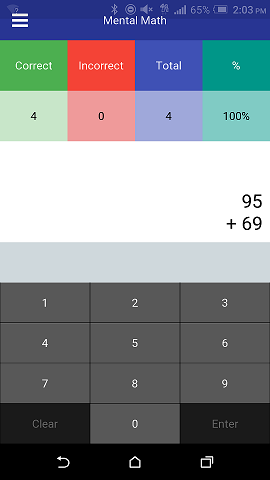

# Mental Math

This is me experimenting with kivy.

It's a small app designed to practice the tips from the book "Secrets of Mental Math"

<iframe type="text/html" width="336" height="550" frameborder="0" allowfullscreen style="max-width:100%" src="https://read.amazon.com/kp/card?asin=B000Q80SM6&asin=B000Q80SM6&preview=inline&linkCode=kpe&ref_=cm_sw_r_kb_dp_jCxBxb2S7Q9CQ" ></iframe>

